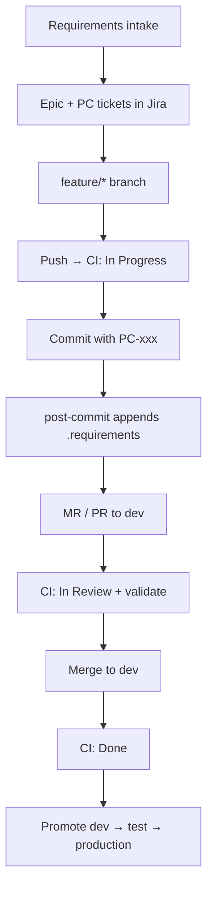

# PolyCal requirements workflow

Canonical process linking **planning (Jira)** to **implementation (git)** and **audit trail (`.requirements`)**.

| System | Role |
|--------|------|
| **Jira (PC)** | Source of truth for planned work, status, acceptance criteria |
| **Git (`feature/*`)** | Implementation tied to `PC-xxx` in every commit |
| **`.requirements`** | Append-only log of what was delivered, per commit |

---

## Lifecycle



---

## Phase 1 — Intake and planning

1. Requirements arrive (from product owner, Confluence, or chat).
2. Break each requirement into **discrete, implementable items**.
3. Create a **Jira Epic** first (project **PC**), then child tickets:
   - **Story** / **Task** for user-facing or technical work
   - **Bug** for defects
4. Each ticket includes:
   - **Summary** — one-line implementable goal
   - **Description** — acceptance criteria
   - **Label** `REQ-<area>-<nnn>` (e.g. `REQ-CAL-001`) for stable requirement IDs
   - **Component** or **module hint** (e.g. `calendar`, `auth`) when known
5. Move ticket to **To Do** (or your board’s equivalent).

**Agent responsibility:** When given requirements, create the Epic + tickets via Jira before writing code.

---

## Phase 2 — Implementation

1. Create branch: `feature/<short-description>` or `feature/PC-123-short-description`.
2. **In Progress** — set automatically on first push to `feature/*` (CI), or manually/agent when work starts.
3. Every commit on `feature/*` **must** include the Jira key:

   ```
   feat(calendar): add weekly view PC-42
   ```

4. Use [Conventional Commits](https://www.conventionalcommits.org/) + `PC-xxx` at end of subject.
5. **post-commit** appends a row to `.requirements`.
6. Include `.requirements` updates in the same MR (final commit before merge is fine).

---

## Phase 3 — Review and merge

1. Open **MR/PR** from `feature/*` → `dev`.
2. **In Review** — set automatically when the PR/MR opens (CI extracts `PC-xxx` from commits).
3. CI runs `validate-jira-commits` and `npm-audit` on all commits in the MR.
4. On **merge to `dev`**:
   - CI extracts all `PC-xxx` keys from merged commits
   - Transitions each ticket to **Done** (requires `JIRA_*` secrets in CI)
5. Promote `dev` → `test` → `production` per branch strategy.

---

## Jira board status (who moves what)

| Status | Trigger | Handler |
|--------|---------|---------|
| **To Do** | Ticket created | Agent / you (intake) |
| **In Progress** | Push to `feature/*` | **CI** (`jira-sync-in-progress`) |
| **In Review** | PR/MR opened → `dev` | **CI** (`jira-sync-in-review`) |
| **Done** | Merge to `dev` | **CI** (`jira-sync-on-merge`) |

**You do not need to drag cards manually** when CI secrets are configured and the standard promotion path is followed.

**Agent discipline (gap fallback):** When working in Cursor, the agent must still transition tickets via Jira if CI has not run yet (e.g. before first push: **In Progress**; after push before PR: **In Review**). Never mark **Done** until code is merged to `dev` — except when manually confirming a hotfix path with the user.

Checking acceptance criteria in the ticket description does **not** change board status; only workflow transitions do.

---

## Phase 4 — Traceability

| Question | Where to look |
|----------|----------------|
| What was planned? | Jira PC-xxx |
| What was built? | `.requirements` row + commit SHA |
| Where is the code? | Module column in `.requirements` |
| Stable requirement ID? | Jira label `REQ-*-*` |

---

## `.requirements` log format

```
YYYY-MM-DD | <sha> | PC-<n> | <summary> | <module path>
```

- **Append-only** — never edit or delete completed rows.
- One row per commit (automatic via `scripts/append-requirement.ts`).

---

## Jira field conventions (project PC)

| Field | Convention |
|-------|------------|
| Project key | `PC` |
| Epic naming | `[Epic] <feature area>` |
| Labels | `REQ-<area>-<nnn>` per discrete requirement |
| Branch link | Add MR/PR URL as comment when opening review |

---

## Branch ↔ environment map

| Branch | Environment | Database |
|--------|-------------|----------|
| `feature/*` | Local / preview | Local SQLite |
| `dev` | `polycal-dev` (Vercel) | Local / dev SQLite |
| `test` | `polycal-test` (Vercel) | Turso `polycal-test` |
| `production` | Production (Vercel) | Turso `polycal-prod` |

---

## Tooling reference

| Command | Purpose |
|---------|---------|
| `npm install` | Install deps + git hooks |
| `npm run requirements:validate` | Check HEAD commit for `PC-xxx` |
| `npm run requirements:append` | Manually append log row |
| `npm run jira:sync-merge` | Transition merged tickets to Done |
| `npm run jira:sync-review` | Transition tickets to In Review (manual) |
| `npm run jira:sync-progress` | Transition tickets to In Progress (manual) |

See also: [ARCHITECTURE.md](./ARCHITECTURE.md), [CHANGELOG.md](../CHANGELOG.md).

---

## CI/CD jobs

| Job | Trigger | Action |
|-----|---------|--------|
| `validate-jira-commits` | MR + `feature/*` push | Enforce `PC-xxx` in commits |
| `npm-audit` | MR → `dev` + `feature/*` push | Fail on unresolved `npm audit` findings (low+) |
| `jira-sync-in-progress` | Push to `feature/*` | Transition `PC-xxx` → In Progress |
| `jira-sync-in-review` | PR/MR → `dev` | Transition `PC-xxx` → In Review |
| `jira-sync-on-merge` | Push to `dev` | Transition `PC-xxx` → Done |

**Jira sync** requires `JIRA_BASE_URL`, `JIRA_EMAIL`, and `JIRA_API_TOKEN` in CI secrets (configured in GitHub).

---

## Agent checklist (Cursor / AI)

When implementing a requirement:

- [ ] Jira Epic + ticket exists (or create before coding)
- [ ] Transition ticket to **In Progress** when starting (if not yet pushed)
- [ ] Branch is `feature/*`
- [ ] Commits include `PC-xxx`
- [ ] `.requirements` updated (automatic)
- [ ] Transition to **In Review** after push if no PR exists yet (CI handles once PR is open)
- [ ] MR targets `dev`
- [ ] **Do not** set **Done** until merge to `dev` (CI handles on merge)
- [ ] Changelog updated for significant changes
