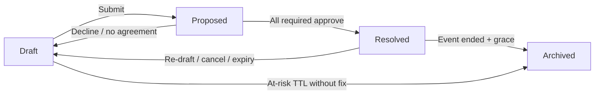

# PolyCal User Manual — Proposals, Roles & Phases

This guide explains how scheduling proposals work in PolyCal: what you can propose, who does what, and how items move through the workflow from draft to archive.

---

## 1. Big picture

PolyCal coordinates a **poly group’s shared calendar**. Most scheduling happens through **proposals** on the **Proposals** tab:

| Tab | What you see |
|-----|----------------|
| **Drafts** | Your in-progress proposals (only the proposer sees their own drafts). |
| **Proposed** | Items waiting for your vote or action. |
| **Resolved** | Approved items on the calendar. |
| **Archived** | Past, read-only history. |

Approved proposals appear on the **Schedule** tab. Color coding:

- **Yellow / striped** — proposed (tentative)
- **Green** — approved events
- **Blue** — approved sleeping arrangements
- **Red / warning** — conflicts or **at risk** status

The **Feed** tab is a shared network timeline (milestones + chat). When you include an `https` URL in a chat message or comment, PolyCal linkifies it and may show a Facebook-style preview card (title, description, image) from the page’s Open Graph metadata.

---

## 2. Roles

### Account roles (who can log in)

| Role | Description |
|------|-------------|
| **Admin** | Full access to the **Admin** tab: user lifecycle, poly group settings, enforcement timers, and audit log. Admins can also **impersonate** another user to act on their behalf. |
| **User** | Standard member: schedule, proposals, people & places, profile. |
| **Proxy** | Schedulable profile without login. Admins can add proxy people to proposals; they can be upgraded to User later. |

### Roles on a specific proposal

| Role | Meaning |
|------|---------|
| **Proposer** | Created the proposal. Can edit drafts, submit, re-draft, cancel, and manage invitees (within rules below). |
| **Required invitee** | Must respond before the proposal can finalize. Unanimous approval (Accept, Accept Sub-optimal, or Abstain) is required among required invitees. |
| **Optional invitee** | May vote; their response is logged but does not block resolution. After required attendees resolve an item, unfinished optional invitees keep it on **Proposed** with a needs-action highlight and an actionable notification until they Accept or Decline (polls: complete slot votes). Optional RSVP still does not change the schedule. |

When adding people to a draft, each person is marked **Required**, **Optional**, or **None** (not invited).

### Sleeping partnerships (separate from proposals)

Under **People & Places**, members can **propose sleeping partnerships** with each other. Pending partnership requests also appear as cards on the **Proposed** tab. Sleeping arrangement details on the schedule are visible to the proposer, invitees, and admins (the "involved" network) — not the same thing as a sleeping *proposal*, but related to who can see sleeping details.

---

## 3. Types of proposals

### Event proposals

A **time block** involving group members (meetings, dates, appointments, etc.).

- **Single occurrence** — one start/end (or date range for multi-day events).
- **Recurring** — daily, weekly, monthly, or yearly pattern (2–52 occurrences). The series is approved as one decision; each occurrence becomes a child on the calendar.
- **Poll (multi-slot)** — the proposer offers several time options (Slot A, B, C…). Required invitees vote on **each slot**. When everyone has finished, the system picks a mutually agreeable winning slot—or returns the proposal to Drafts if none exist.
- **Solo event** — only the proposer is involved. Can skip the voting queue and go straight to Resolved when submitted (same idea as intentional solo for sleeping).

Event details are visible to everyone in the group once resolved — there are no private or super-private event levels.

### Sleeping proposals

An **overnight stay** at a place (from People & Places) or a free-text location.

- **Single night** or **date range** (different arrangements per night in a range).
- **Recurring** — same invitee list and location for every occurrence.
- **Intentional solo** — set at creation; only the proposer is invited. On submit, sleeping proposals with intentional solo **auto-approve** and go directly to Resolved (no Proposed queue).
- **Bedroom / place locking** — sleeping proposals can target a specific bedroom at a registered place when configured.

---

## 4. Phases (proposal lifecycle)

Every schedule proposal moves through **four phases**. Think of them as columns on the Proposals board.

### Phase 1 — Draft

**Who sees it:** Only the proposer (Drafts tab).

**What happens here:**

- Fill the happy path first: **events** — title, when (digital time), invitees (Required/Optional), location; **sleeping** — who (partners), night of / last night, place and bedroom. Use **More options** for description, notes, poll, recurrence, reminder, and icons.
- Notes are shared with invitees.
- Save anytime (keeps a draft); Submit sends it for approval. Nothing is on the shared calendar until resolved.
- **Conflict warnings** may appear if invitees already have overlapping events. You can still save and submit; reviewers see the same warnings.

**Leaving Draft:**

- **Submit** → moves to **Proposed** (unless solo auto-approve applies → **Resolved**).
- Submit requires at least one required invitee **or** an intentional solo / solo event flag.

### Phase 2 — Proposed

**Who sees it:** Proposer and all invitees (Proposed tab).

**What invitees do:**

Vote options:

| Vote | Effect |
|------|--------|
| **Accept** | Counts toward approval. |
| **Accept sub-optimal** | Counts toward approval (poll: willing but not ideal). |
| **Abstain** | Counts as approval for threshold purposes (“no preference / available”). In polls, completes your row as available for all slots. |
| **Decline** | **Non-poll:** returns proposal to **Drafts** (proposer can remove decliner and resubmit). **Poll:** stays Proposed until all required rows are in; if no slot works for everyone, goes to Drafts. |

**Resolution rule:** When every **required** invitee has responded and all responses are Accept, Accept sub-optimal, or Abstain, the proposal becomes **Resolved** and the winning time is written to the schedule. Unfinished **optional** invitees still see the card on **Proposed** (with a needs-action prompt and actionable notification) until they RSVP; their vote does not reopen or block the schedule.

**While Proposed:**

- Cards show a live **countdown** until the proposal would expire (event start / sleeping day-end, and/or the admin **max days in Proposed** limit).
- **At risk** items also show time remaining on the at-risk TTL when set.
- The proposer (or an admin) can press **Nudge** (upper-right on the card) to remind everyone who has not voted yet. Nudges are limited to once per hour per proposal.
- If the event **start time passes** without full approval → system returns it to **Drafts** and resets votes (proposer is notified).
- If admins set a **max days in Proposed** limit and time runs out → same return to Drafts.
- If another proposal **resolves** and overlaps this one, conflicting pending proposals may be **auto-declined** with a system note for the proposer to review.

**Overlap warning:** If you already voted and a new conflict appears on your calendar, you may see an overlap warning and can acknowledge or decline.

### Phase 3 — Resolved

**Who sees it:** On the **Schedule** (and Resolved tab). Events are visible to everyone in the group; sleeping arrangement details are visible to the proposer, invitees, and admins.

**What it means:** The event is **confirmed** on the calendar with a fixed start/end (or winning poll slot).

**After resolution, the proposer or admin can:**

- **Cancel** — removes from calendar (archives); notifications go out.
- **Re-draft** — returns to Drafts but keeps a calendar hold marked **At risk** until re-submitted and re-approved.

**Admins** can also **Delete proposal** from detail or any Kanban column (including **Archived**). This permanently removes the proposal (and optionally an entire recurring series) and notifies all participants.
**Changing attendees on a resolved event:**

- **Add required** — new person gets their own Proposed vote; core event stays Resolved until they accept.
- **Add optional** — optional onboarding vote only.
- **Remove required (by proposer)** — event stays Resolved; removed person is notified; remaining required invitees may reconfirm.
- **Remove required (self-decline)** — marks event **At risk** and sends it back toward re-approval.

**At risk:** A resolved event that may no longer be valid (re-draft, decline after resolution, etc.). The block stays visible on the schedule with a warning until:

- The proposer fixes and resubmits, or
- Within **redraft deadline** hours of start → automatically returns to **Proposed** for re-vote, or
- **At-risk TTL** expires or the event starts without resolution → auto-cancelled and archived.

**Missing invitees (recovery):** If a resolved proposal loses **all required invitees** (and is not intentional solo), the calendar hold enters **pending recovery** for a configurable period (default 48 hours). The proposer must add invitees or mark solo. If recovery time expires → back to **Drafts** with a system note.

### Phase 4 — Archived

**Who sees it:** Archived tab (read-only).

**How items get here:**

- Single events: automatically after a **grace period** past scheduled end (default 24 hours).
- Recurring series: when the **final occurrence** has ended plus grace.
- At-risk drafts that expire without resubmission.
- Cancelled at-risk resolved events after auto-cancel.

---

## 5. Special flows

### Intentional solo (sleeping) / solo event

- Locked at creation for sleeping solo: only the proposer.
- Submit → **Resolved** immediately, no voting queue.
- If a non-solo proposal later has **zero required invitees**, it cannot auto-resolve; the proposer must add people or enable solo.

### Poll proposals

1. Proposer adds multiple time slots in Draft.
2. On submit, required invitees vote **per slot** (matrix).
3. System waits until every required invitee completes every row.
4. If at least one slot works for all required voters → resolve to best slot.
5. If none → back to Drafts.

### Recurring series

- Parent proposal defines the pattern; child occurrences appear on the schedule when resolved.
- Editing one occurrence vs the whole series may prompt **this occurrence only** vs **entire series**.
- Series archives when the last child occurrence is past end date + grace.

### Paused or deleted users

| User status | Effect on proposals |
|-------------|---------------------|
| **Paused** | Cannot log in; treated as **optional** on active proposals. If that leaves zero required invitees, proposal reverts to proposer’s Drafts. |
| **Deleted** | Removed from workflow; proposer’s pending/resolved events they solely own may be cancelled; historical records keep a generic placeholder name. |

---

## 6. Notifications & audit

- Submit, vote, resolve, decline, at-risk, recovery, partnership, **nudge**, and **admin delete** changes generate **notifications** (bell icon).
- Optional **notification email** (Profile): verify the address to receive the same alerts by email when the email channel is enabled.
- **Forgot password?** on the sign-in page emails a reset link only when that verified notification email is set.
- **Calendar integration** (Profile, and optional onboarding step):
  - **Google Calendar** — connect your Google account and pick an existing calendar. Confirmed events sync automatically (create/update/delete). Sleeping arrangements appear as all-day events marked free on your calendar, using the same title as in PolyCal.
  - **iCal / Other** — choose Download, Email, or Both for `.ics` files (Apple Calendar, Outlook, etc.). If email is not available, PolyCal notifies you and offers a download when you next open the app.
- Each proposal keeps an **activity / audit log** of state changes (who did what, when). Admins can configure how visible that log is (everyone → admin only).

---

## 7. Admin timers (defaults)

Admins can tune enforcement under **Admin → Poly Group Settings**. Defaults if unchanged:

| Setting | Default | What it does |
|---------|---------|----------------|
| Max days in Proposed | 0 (off) | Only expire Proposed when event start passes |
| At-risk draft TTL | 7 days | Drafts left at-risk without action → Archived |
| Sleeping partner proposal TTL | 5 days | Unanswered partnership proposals are deleted; both people notified |
| Archive grace | 24 h | After event end before Resolved → Archived |
| Redraft deadline | 24 h | Before event start, at-risk Resolved → Proposed again |

Admins can also toggle **Admins can see proposals they are not involved in** (default on). When off, admins only see proposals they proposed or are invited to. Peach card chrome marks uninvolved admin oversight views only — not when the admin is an invitee.

---

## 8. Quick reference — “What should I do?”

| Situation | Action |
|-----------|--------|
| Create a new hangout | Proposals → **+** → Event → Draft → Submit |
| Plan overnight at a partner’s place | Proposals → Sleeping → set place, invitees, submit |
| Just me, no vote needed | Enable **solo / intentional solo** before submit |
| Several time options | Enable **poll**, add slots, submit |
| Someone sent you a proposal | Proposals → **Proposed** → open → vote |
| Event approved but needs changes | Open on Schedule or Resolved → **Re-draft** |
| Wrong people on an approved event | Proposer: attendee controls on resolved detail |
| Can’t see sleeping details | You’re not the proposer, an invitee, or an admin |
| Proposal vanished from Proposed | Check **Drafts** (declined/expired) or **Resolved** (approved while you were away) |

---

## Related docs

- [ARCHITECTURE.md](./ARCHITECTURE.md) — technical environment map  
- [REQUIREMENTS-WORKFLOW.md](./REQUIREMENTS-WORKFLOW.md) — development & Jira process (for builders)

*Last updated for PC-282 (post-280 audit: timezone-safe sleeping nights, feed-image ACL, impersonation admin gate, Playwright accuracy). Builds on PC-280 removals (Planning, Clone, group-name, power management, private/super-private; sleeping involved-only).*
